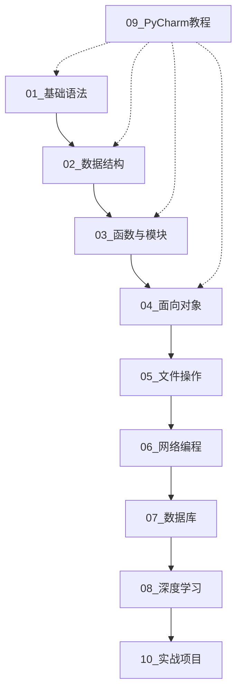

# 🐍 Python 学习之路 - 从零基础到独立开发

<div align="center">


**一个系统性的 Python 学习项目，带你从零基础到独立开发**

[开始学习](#-学习路线图) · [项目结构](#-项目结构) · [环境配置](#-环境配置) · [贡献指南](#-贡献指南)

</div>

---

## 📖 项目简介

本项目专为 Python 零基础学习者设计，通过**模块化学习**和**实战项目**相结合的方式，帮助你系统地掌握 Python 编程技能。项目涵盖从基础语法到高级应用，包括网络编程、数据库操作和深度学习（PyTorch）等内容。

### ✨ 特色

- 🎯 **渐进式学习路径** - 从基础到进阶，循序渐进
- 💻 **大量代码示例** - 每个知识点都有详细的代码演示
- 🔧 **PyCharm 专业教程** - 学会像真正的开发者一样使用 IDE
- 🌐 **全栈技能覆盖** - 网络编程、数据库、深度学习
- 🚀 **实战项目驱动** - 理论与实践相结合
- 📝 **中文详细注释** - 每行代码都有清晰解释

---

## 🗺️ 学习路线图



---

## 📁 项目结构

```
PythonLearning/
│
├── 01_基础语法/                    # Python 基础入门
│   ├── 01_变量与数据类型.py        # 变量定义与基本数据类型
│   ├── 02_运算符.py                # 算术、比较、逻辑运算符
│   ├── 03_字符串操作.py            # 字符串方法与格式化
│   ├── 04_条件语句.py              # if/elif/else 分支结构
│   ├── 05_循环语句.py              # for/while 循环
│   └── 06_异常处理.py              # try/except 异常捕获
│
├── 02_数据结构/                    # Python 核心数据结构
│   ├── 01_列表.py                  # 列表的创建、操作与方法
│   ├── 02_元组.py                  # 不可变序列元组
│   ├── 03_字典.py                  # 键值对字典
│   ├── 04_集合.py                  # 无序不重复集合
│   └── 05_推导式.py                # 列表/字典/集合推导式
│
├── 03_函数与模块/                  # 函数式编程
│   ├── 01_函数基础.py              # 函数定义与调用
│   ├── 02_参数与返回值.py          # 位置参数、关键字参数、*args/**kwargs
│   ├── 03_作用域与闭包.py          # 变量作用域、闭包函数
│   ├── 04_装饰器.py                # 函数装饰器详解
│   ├── 05_递归函数.py              # 递归思想与应用
│   ├── 06_匿名函数.py              # lambda 表达式
│   └── 07_模块与包.py              # import、from...import、自定义模块
│
├── 04_面向对象/                    # OOP 面向对象编程
│   ├── 01_类与对象.py              # 类的定义与实例化
│   ├── 02_属性与方法.py            # 实例属性、类属性、静态方法
│   ├── 03_继承.py                  # 单继承、多继承、super()
│   ├── 04_多态与封装.py            # 多态特性与封装
│   ├── 05_魔法方法.py              # __init__、__str__、__repr__ 等
│   └── 06_属性装饰器.py            # @property 属性管理
│
├── 05_文件操作/                    # 文件与数据处理
│   ├── 01_文件读写.py              # open()、with 语句
│   ├── 02_文件路径操作.py          # os、pathlib 模块
│   ├── 03_JSON处理.py              # JSON 序列化与反序列化
│   ├── 04_CSV处理.py               # CSV 文件读写
│   └── 05_序列化.py                # pickle 序列化
│
├── 06_网络编程/                    # 网络通信与 API
│   ├── 01_Socket编程/              # TCP/UDP Socket 通信
│   ├── 02_HTTP请求/                # requests 库使用
│   ├── 03_REST_API/                # RESTful API 调用
│   ├── 04_爬虫入门/                # 网页数据抓取
│   └── 05_异步编程/                # asyncio、aiohttp
│
├── 07_数据库/                      # 数据库操作
│   ├── 01_SQLite/                  # SQLite 轻量级数据库
│   ├── 02_MySQL/                   # MySQL 数据库连接
│   ├── 03_ORM基础/                 # SQLAlchemy ORM
│   └── 04_MongoDB/                 # NoSQL 数据库
│
├── 08_深度学习/                    # PyTorch 深度学习
│   ├── 01_Tensor基础/              # 张量创建与操作
│   ├── 02_自动求导/                # autograd 机制
│   ├── 03_神经网络/                # nn.Module 构建网络
│   ├── 04_数据加载/                # Dataset、DataLoader
│   ├── 05_训练与验证/              # 模型训练流程
│   └── 06_实战案例/                # MNIST、图像分类等
│
├── 09_PyCharm教程/                 # IDE 使用指南
│   ├── 01_安装与配置.md            # PyCharm 安装与初始化
│   ├── 02_项目创建.md              # 创建与管理项目
│   ├── 03_调试技巧.md              # 断点调试详解
│   ├── 04_代码重构.md              # 重构工具使用
│   ├── 05_版本控制.md              # Git 集成使用
│   ├── 06_插件推荐.md              # 实用插件安装
│   └── 07_快捷键大全.md            # 高效快捷键
│
├── 10_实战项目/                    # 综合项目实战
│   ├── 01_命令行待办事项/          # CLI 应用开发
│   ├── 02_网页爬虫项目/            # 数据采集系统
│   ├── 03_Flask博客系统/           # Web 应用开发
│   ├── 04_数据分析项目/            # Pandas 数据分析
│   └── 05_图像分类模型/            # 深度学习应用
│
├── README.md                       # 项目说明文档
├── requirements.txt                # 依赖包列表
└── .gitignore                      # Git 忽略配置
```

---

## ⚙️ 环境配置

### 前置要求

- **Python 3.9+** （推荐使用最新稳定版）
- **PyCharm** （推荐 Professional 版，Community 版也可）
- **Git** （版本控制）

### 安装步骤

1. **克隆项目**
   ```bash
   git clone https://github.com/HCX-HERENELDO/PythonLearning0toN.git
   cd PythonLearning0toN
   ```

2. **创建虚拟环境**（推荐）
   ```bash
   # Windows
   python -m venv venv
   venv\Scripts\activate
   
   # macOS/Linux
   python3 -m venv venv
   source venv/bin/activate
   ```

3. **安装依赖**
   ```bash
   pip install -r requirements.txt
   ```

4. **用 PyCharm 打开项目**
   - 打开 PyCharm
   - 选择 `File` → `Open`
   - 选择 `PythonLearning` 文件夹
   - 配置 Python 解释器：`File` → `Settings` → `Project` → `Python Interpreter`

---

## 📚 模块详解

### 🌱 第一阶段：基础入门（01-05模块）

**学习目标**：掌握 Python 基础语法，能够编写简单的程序

| 模块 | 内容 | 预计时间 |
|------|------|----------|
| 01_基础语法 | 变量、数据类型、运算符、控制流 | 1周 |
| 02_数据结构 | 列表、字典、集合、元组 | 1周 |
| 03_函数与模块 | 函数定义、参数、装饰器、模块 | 1周 |
| 04_面向对象 | 类、继承、多态、封装 | 2周 |
| 05_文件操作 | 文件读写、JSON/CSV处理 | 1周 |

### 🚀 第二阶段：进阶应用（06-07模块）

**学习目标**：掌握网络编程和数据库操作，具备全栈开发基础

| 模块 | 内容 | 预计时间 |
|------|------|----------|
| 06_网络编程 | Socket、HTTP、API、爬虫 | 2周 |
| 07_数据库 | SQLite、MySQL、ORM | 2周 |

### 🎯 第三阶段：专业方向（08模块）

**学习目标**：掌握深度学习基础，能够构建神经网络模型

| 模块 | 内容 | 预计时间 |
|------|------|----------|
| 08_深度学习 | PyTorch、神经网络、模型训练 | 4周 |

### 🔧 全程辅助：工具技能（09模块）

**学习目标**：熟练使用 PyCharm，提高开发效率

- 调试技巧：断点、变量监视、步进执行
- 代码重构：重命名、提取方法、移动文件
- 版本控制：Git 集成、冲突解决、分支管理
- 快捷键：高效编码的必备技能

### 🏆 综合实战（10模块）

将所学知识应用到实际项目中，完成可发布的作品。

---

## 💡 学习建议

### 对于零基础学习者

1. **按顺序学习**：模块之间有依赖关系，建议按顺序学习
2. **动手实践**：不要只看不练，每个示例都要自己运行
3. **理解原理**：不要死记硬背，理解代码背后的逻辑
4. **多做练习**：尝试修改示例代码，观察输出变化
5. **善用调试**：学会使用 PyCharm 的调试功能

### 对于有一定基础的学习者

1. **跳过基础**：可以直接从感兴趣的模块开始
2. **重点突破**：重点关注不熟悉的知识点
3. **项目实战**：多参与实战项目，巩固知识

---

## 🛠️ PyCharm 学习路径

在学习 Python 的同时，我们将学习 PyCharm 的使用：

```
第1周 → 项目创建、文件管理、代码编辑
第2周 → 运行程序、查看输出、基础调试
第3周 → 断点调试、变量监视、条件断点
第4周 → 代码重构、查找替换、导航技巧
第5周 → Git 集成、提交代码、解决冲突
第6周 → 插件安装、个性化配置、高效快捷键
```

---

## 📋 依赖说明

本项目使用的核心依赖：

| 库名 | 用途 | 安装命令 |
|------|------|----------|
| requests | HTTP 请求 | `pip install requests` |
| beautifulsoup4 | 网页解析 | `pip install beautifulsoup4` |
| flask | Web 框架 | `pip install flask` |
| sqlalchemy | ORM 框架 | `pip install sqlalchemy` |
| pymysql | MySQL 连接 | `pip install pymysql` |
| pandas | 数据分析 | `pip install pandas` |
| numpy | 数值计算 | `pip install numpy` |
| torch | 深度学习 | `pip install torch` |
| matplotlib | 数据可视化 | `pip install matplotlib` |

完整依赖请参考 `requirements.txt`

---

## 🤝 贡献指南

欢迎贡献代码、提出问题或建议！

1. Fork 本仓库
2. 创建特性分支 (`git checkout -b feature/AmazingFeature`)
3. 提交更改 (`git commit -m 'Add some AmazingFeature'`)
4. 推送到分支 (`git push origin feature/AmazingFeature`)
5. 提交 Pull Request

---

## 📜 许可证

本项目采用 MIT 许可证 - 详见 [LICENSE](LICENSE) 文件

---

## 📮 联系方式

如有问题或建议，欢迎：
- 提交 Issue：[GitHub Issues](https://github.com/HCX-HERENELDO/PythonLearning0toN/issues)
- 发送邮件：hereneldo@163.com
- 提交 Pull Request

**作者**：HCX-HERENELDO

---

<div align="center">

**⭐ 如果这个项目对你有帮助，请给一个 Star ⭐**

**祝学习愉快！Happy Coding! 🎉**

</div>
